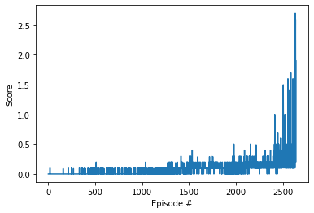

Report for Project 1: Navigation
=====================

A description of solution implementation.

## Learning Algorithm

After numerous trials MADDPG [[1]](https://arxiv.org/abs/1706.02275) algorithm policy was used to train the agent. All implementations are contained in [Tennis.ipynb](Tenis.ipynb).

### Hyperparameters used (DDPG):

These set of hyperparamethers and model architecture was used, following suggestions from Udacity's forum:

- `n_episodes = 5000` - max number of episodes during training
- `BUFFER_SIZE = 1e6` - size of replay buffer
- `BATCH_SIZE = 256` - minibatch size
- `GAMMA = 0.99` - TD discount factor
- `TAU = 1e-3` - for soft update of target parameters (to have fixed q-targets)
- `LR_ACTOR = 5e-4` - learning rate
- `LR_CRITIC = 1e-3` - learning rate
- `UPDATE_EVERY` = 20 - learning is performed at this iterations interval
- `UPDATE_STEPS` = 15 - n steps of buffer sampling and learning are performed

### Neural network architecture:
#### Actor
 - Linear layer with 24 input features, 400 output features and bias
 - ReLU
 - Linear layer with 400 input features, 300 output features and bias
 - ReLU
 - Linear layer with 200 input features, 2 output features and bias
 - Tanh

 Trained model weights are stored in:
 - `actor_0_local.pth`
 - `actor_1_local.pth`
 - `actor_0_target.pth`
 - `actor_1_target.pth`
 files.

#### Crititc
 - Linear layer with 48 input features, 400 output features and bias
 - ReLU
 - Linear layer with 400 input features + 4 action features, 300 output features and bias
 - ReLU
 - Linear layer with 300 input features, 1 output feature

 Trained model weights are stored in:
 - `critic_0_local.pth`
 - `critic_1_local.pth`
 - `critic_0_target.pth`
 - `critic_1_target.pth`
 files.

## Plot of Rewards

The plot above illustrates that the agent was able able to receive an average reward (over 100 episodes) of at least +0.5 after the first 2640 episodes.

## Ideas for Future Work

For the DDPG implementation, a shared actor-critic model could be used to optimize the model size. Also the three tricks from the Twin Delayed DDPG (TD3) [[2]](https://spinningup.openai.com/en/latest/algorithms/td3.html) could be used to further improve the learing process:
- reduce Q-value overestimation by learning two Q-functions and using the smaller Q-values to form targets
- update policy less frequently than the Q-function
- smooth Q-values by adding clipped noise to the target action
The implementation details can be found in OpenAI blog [post](https://spinningup.openai.com/en/latest/algorithms/td3.html).
